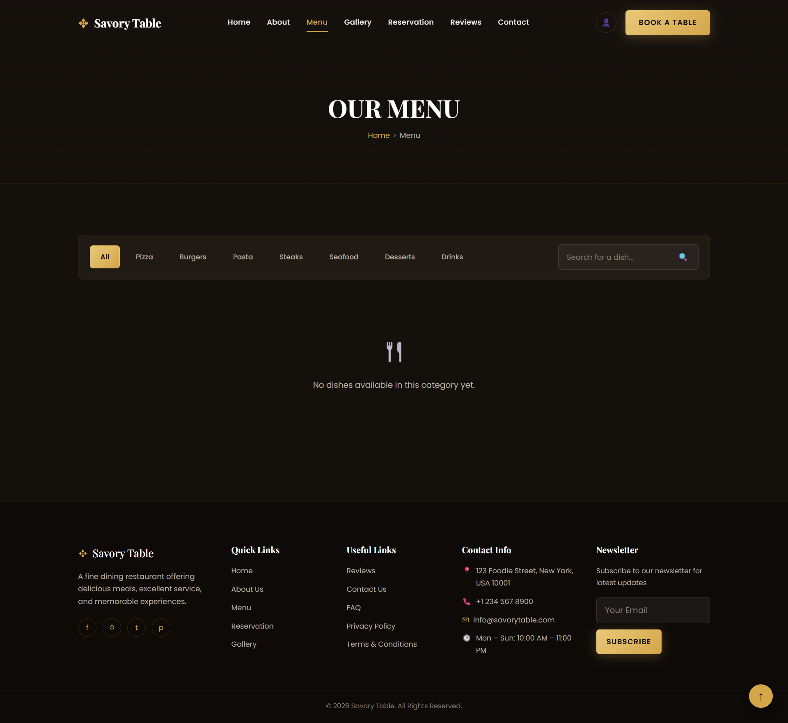
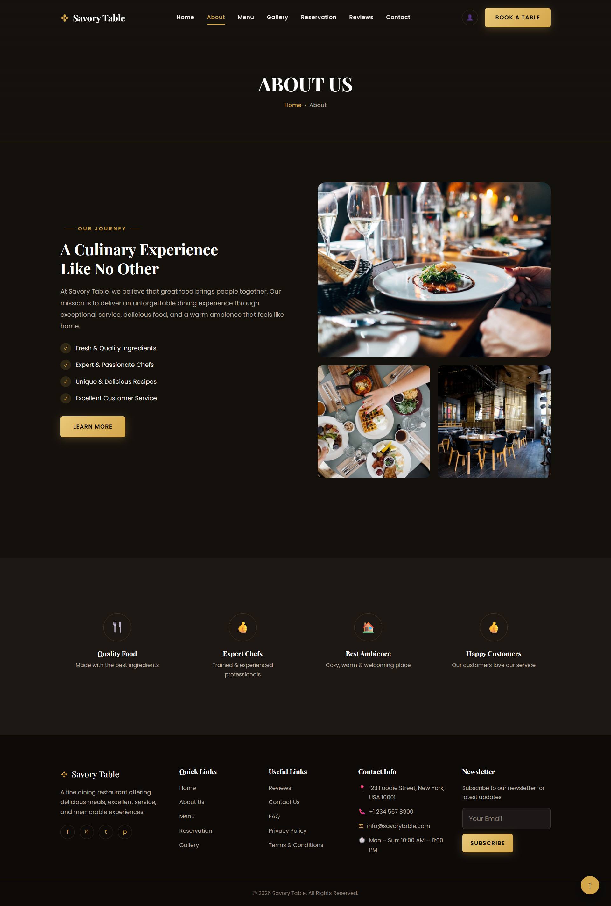
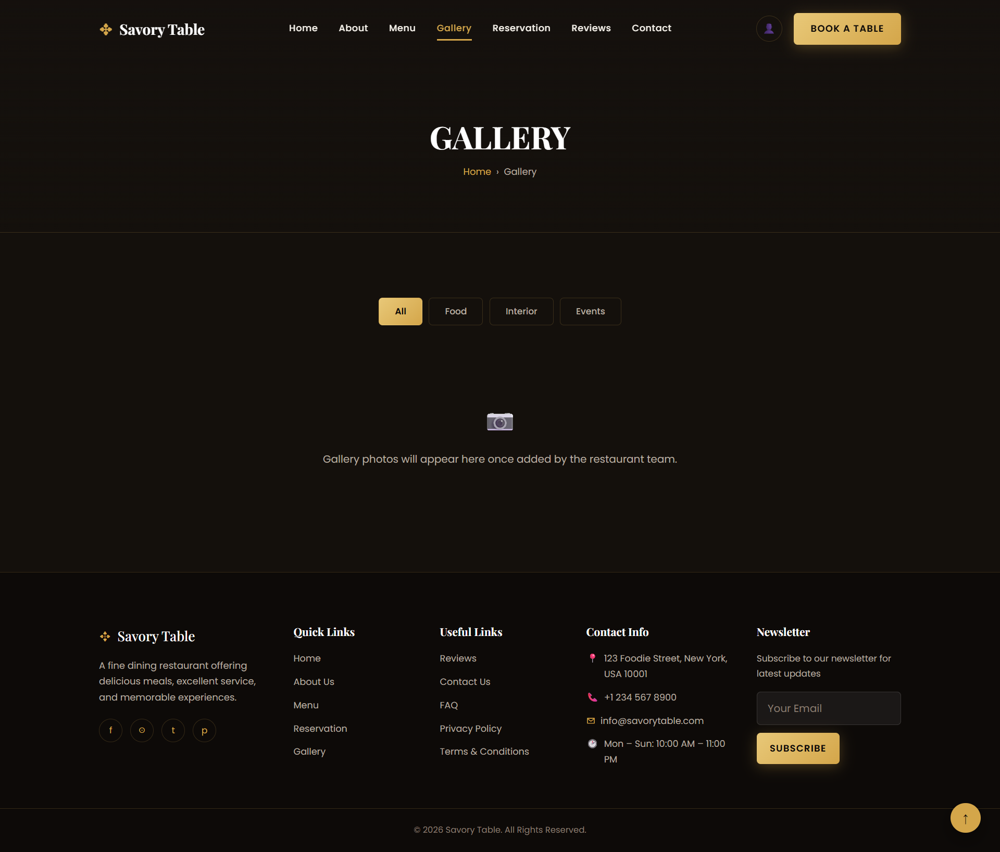
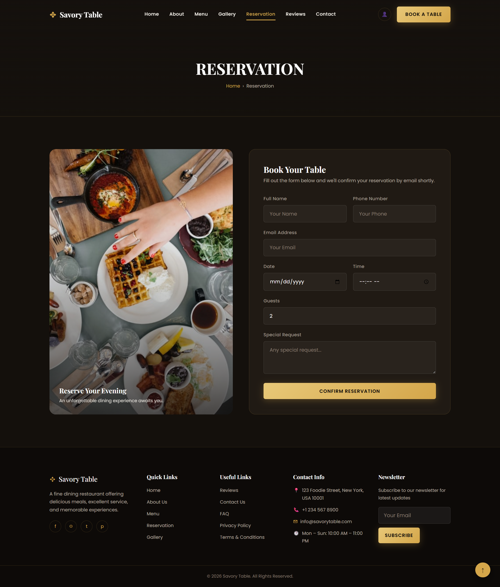
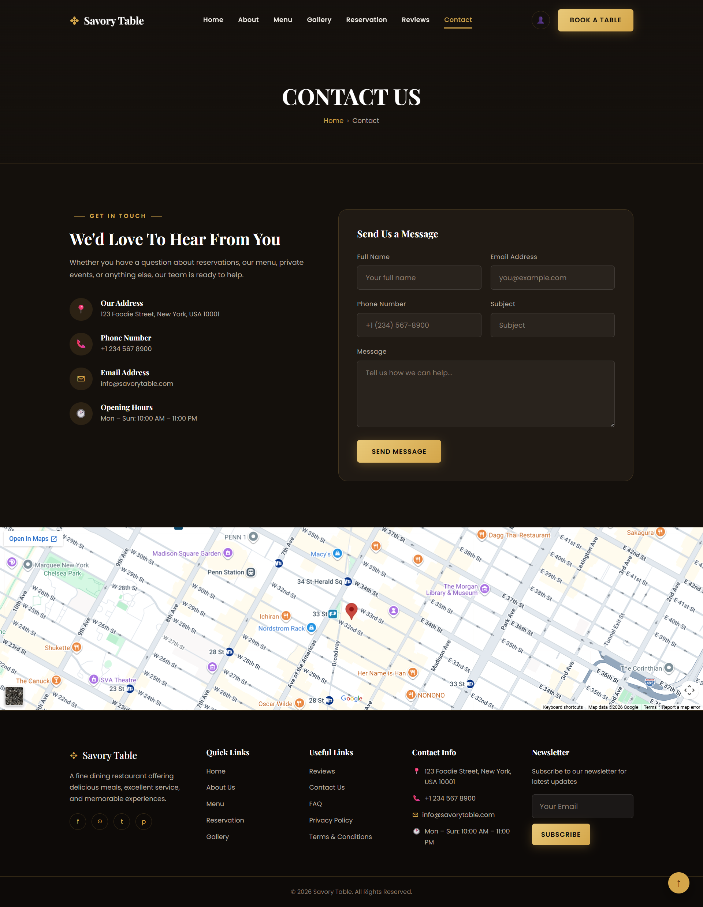

# 🍽️ Savory Table – Premium Restaurant Website

A modern, responsive, and production-ready restaurant website built with **Django**.  
This project provides a complete digital solution for restaurants, allowing customers to explore menus, reserve tables online, browse the gallery, submit reviews, and contact the restaurant through an elegant user interface.

🌐 **Live Demo:** https://savorytable.pythonanywhere.com/

---

# 📌 Project Overview

Savory Table is a full-stack restaurant web application designed to improve the online presence of restaurants and provide customers with a smooth digital dining experience.

The project focuses on performance, clean UI, responsive design, and easy navigation across all devices.

---

# ✨ Key Features

- Modern Responsive Design
- Elegant Dark Theme
- User Registration & Login
- Customer Dashboard
- Online Table Reservation
- Digital Restaurant Menu
- Menu Categories & Search
- Customer Reviews & Ratings
- Restaurant Gallery
- Contact Form
- Newsletter Subscription
- Admin Management Panel
- Secure Authentication
- Mobile Friendly Interface

---

# 🛠 Tech Stack

### Backend
- Python
- Django

### Frontend
- HTML5
- CSS3
- JavaScript

### Database
- SQLite (Development)

### Deployment
- PythonAnywhere

---

# 📂 Project Structure

```
accounts/
core/
gallery/
menu/
reservations/
reviews/
static/
templates/
manage.py
requirements.txt
```

---

# 🚀 Installation

```bash
git clone https://github.com/danishhussain-1/savory-table.git

cd savory-table

python -m venv venv

venv\Scripts\activate

pip install -r requirements.txt

python manage.py migrate

python manage.py createsuperuser

python manage.py runserver
```

---

# 📸 Screenshots

## 🏠 Home


## 🍽️ Menu



## 👨‍🍳 About



## 🖼️ Gallery



## 📅 Reservation



## 📞 Contact



---

# 🌐 Live Demo

https://savorytable.pythonanywhere.com/

---

# 👨‍💻 Developer

**Danish Hussain**

Full Stack Python & Django Developer

Specialized in building responsive business websites using:

- Python
- Django
- Flask
- HTML
- CSS
- JavaScript
- PostgreSQL
- SQLite

---

# 📧 Contact

Email:

danishliaqat267@gmail.com

---

⭐ If you like this project, consider giving it a star.
